# SAT Puzzle Solver

Solve classic logic puzzles problems in Python.  
Each puzzle family lives in its own folder with a minimal, self-contained example.

Play the original puzzles online: https://www.chiark.greenend.org.uk/~sgtatham/puzzles

All the solvers in this repo use the CP-SAT solver from Google OR-Tools.

---

## Table of Contents

- [SAT Puzzle Solver](#sat-puzzle-solver)
  - [Table of Contents](#table-of-contents)
  - [Why SAT / CP-SAT?](#why-sat--cp-sat)
  - [What’s Inside](#whats-inside)
- [Puzzles](#puzzles)
  - [Nonograms (Puzzle Type #1)](#nonograms-puzzle-type-1)
  - [Sudoku (Puzzle Type #2)](#sudoku-puzzle-type-2)
  - [Light Up (Puzzle Type #3)](#light-up-puzzle-type-3)
  - [Tents (Puzzle Type #4)](#tents-puzzle-type-4)
  - [Filling (Puzzle Type #5)](#filling-puzzle-type-5)
  - [Towers (Puzzle Type #6)](#towers-puzzle-type-6)
  - [Singles (Puzzle Type #7)](#singles-puzzle-type-7)
  - [Magnets (Puzzle Type #8)](#magnets-puzzle-type-8)
  - [Range (Puzzle Type #9)](#range-puzzle-type-9)
  - [UnDead (Puzzle Type #10)](#undead-puzzle-type-10)
  - [Unruly (Puzzle Type #11)](#unruly-puzzle-type-11)
  - [Mosaic (Puzzle Type #12)](#mosaic-puzzle-type-12)
  - [Quick Start](#quick-start)
    - [1) Install Python deps](#1-install-python-deps)
    - [2) Explore a puzzle](#2-explore-a-puzzle)
  - [Testing](#testing)
  - [Contributing](#contributing)

---

## Why SAT / CP-SAT?

Many pencil puzzles can be modeled with:

- **Boolean decisions** (e.g., black/white, bulb/no-bulb)
- **Linear constraints** (counts, separations, adjacency)
- **All-different / visibility / reachability** constraints

This repo builds those constraints in Python and uses SAT/CP-SAT (e.g., OR-Tools) to search efficiently. It both demonstrates the modeling and provides usable solvers.

---

## What’s Inside

Each chapter directory targets a different puzzle type:

* `chapter10_nonograms` — Picross/Griddlers (run-length constraints). ([Chapter 10][1])
* `chapter11_sudoku` — Sudoku (rows/cols/blocks all-different). ([Chapter 11][2])
* `chapter21_light_up` — *Akari* / Light Up (lighting & adjacency). ([Chapter 21][3])
* `chapter25_tents` — Tents (tree-tent matching). ([Chapter 25][4])
* `chapter29_filling` — Filling (Fillomino-style), region sizes. ([Chapter 29][5])
* `chapter31_towers` — Skyscrapers (permutation + visibility). ([Chapter 31][6])
* `chapter32_single` — Singles (hiding numbers). ([Chapter 32][7])
* `chapter33_magnets` — Magnets (polarized dominoes + counts). ([Chapter 33][8])
* `chapter35_range` — Range (rays & totals). ([Chapter 35][9])
* `chapter37_undead` — UnDead (Vampires/Zombies/Ghosts). ([Chapter 37][10])
* `chapter38_unruly` — Unruly (no triples + balance). ([Chapter 38][11])
* `chapter42_mosaic` — Mosaic (Tapa-like tiling). ([Chapter 42][12])

---

# Puzzles

Only a few puzzles in the website have solvers implemented here. Here we list them:

## Nonograms (Puzzle Type #1)

Called "Pattern" in the website.

* [**Play online**](https://www.chiark.greenend.org.uk/~sgtatham/puzzles/js/pattern.html)

* [**Instructions**](https://www.chiark.greenend.org.uk/~sgtatham/puzzles/doc/pattern.html#pattern)

**Unsolved puzzle**

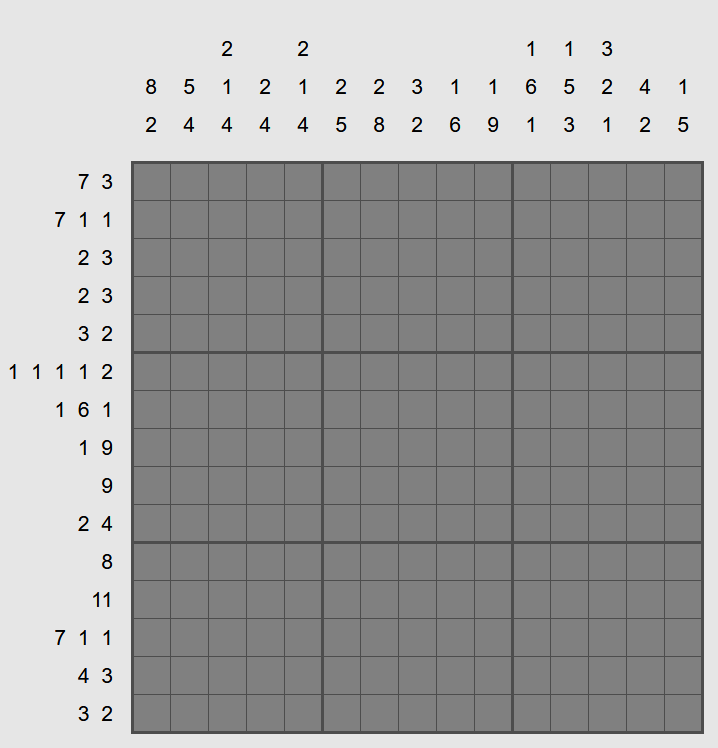

Code to utilize this package and solve the puzzle:
```python
from . import board
top_numbers = [
  [8, 2],
  [5, 4],
  [2, 1, 4],
  [2, 4],
  [2, 1, 4],
  [2, 5],
  [2, 8],
  [3, 2],
  [1, 6],
  [1, 9],
  [1, 6, 1],
  [1, 5, 3],
  [3, 2, 1],
  [4, 2],
  [1, 5],
]
side_numbers = [
  [7, 3],
  [7, 1, 1],
  [2, 3],
  [2, 3],
  [3, 2],
  [1, 1, 1, 1, 2],
  [1, 6, 1],
  [1, 9],
  [9],
  [2, 4],
  [8],
  [11],
  [7, 1, 1],
  [4, 3],
  [3, 2],
]
binst = board.Board(top=top_numbers, side=side_numbers)
solutions = binst.solve_and_print()
```
**Script Output**
```
Solution found
B B B B B B B . B B B . . . .
B B B B B B B . . . . . B . B
B B . . . . . . . . . B B B .
B B . . . . . . . . . . B B B
B B B . . . . . . . . . . B B
B . . . B . B . . B . . . B B
B . . . . . B B B B B B . . B
B . . . . . B B B B B B B B B
. . . . . B B B B B B B B B .
. . . . . B B . B B B B . . .
. . . . B B B B B B B B . . .
B B B B B B B B B B B . . . .
B B B B B B B . . B . B . . .
. B B B B . . . . B B B . . .
. B B B . . . . . . . B B . .
Solutions found: 1
status: OPTIMAL
```

**Solved puzzle**

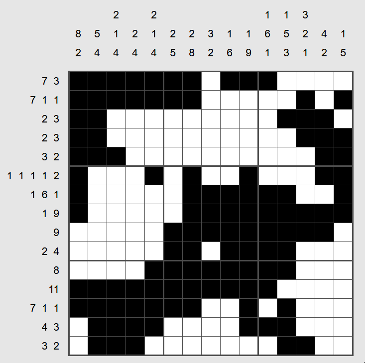

---

## Sudoku (Puzzle Type #2)

Called "Solo" in the website.

* [**Play online**](https://www.chiark.greenend.org.uk/~sgtatham/puzzles/js/solo.html)

* [**Instructions**](https://www.chiark.greenend.org.uk/~sgtatham/puzzles/doc/solo.html#solo)

**Unsolved puzzle**

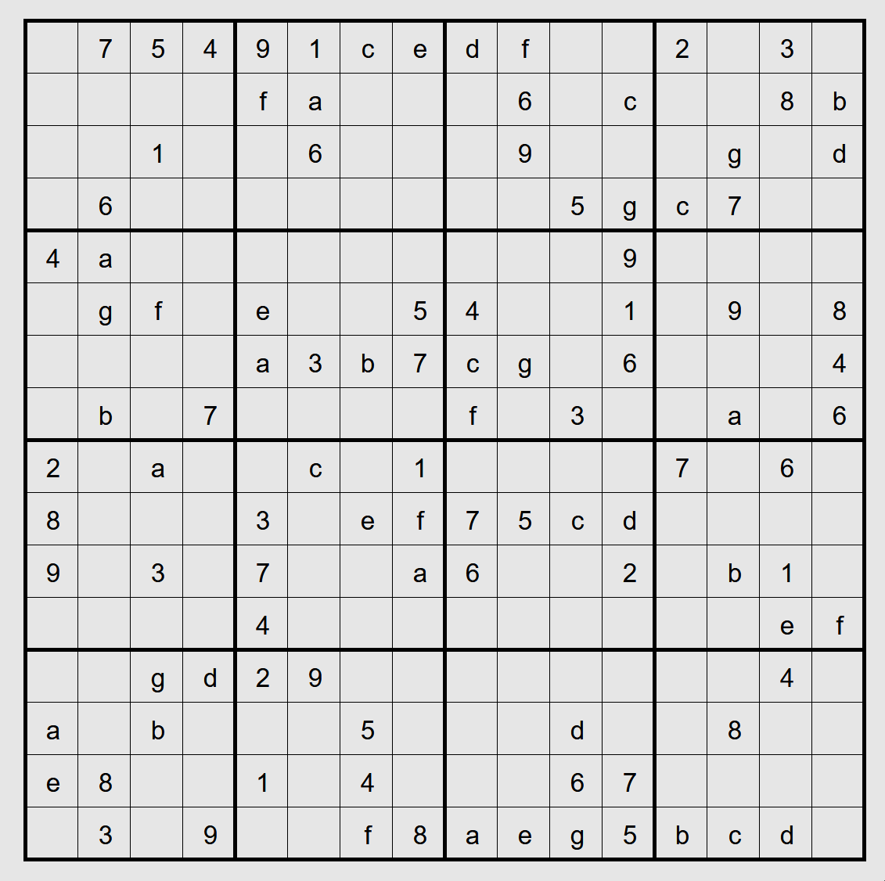

Code to utilize this package and solve the puzzle:
```python
import numpy as np
from . import board
bor = np.array([
  ['*', '7', '5', '4',  '9', '1', 'c', 'e',  'd', 'f', '*', '*',  '2', '*', '3', '*'],
  ['*', '*', '*', '*',  'f', 'a', '*', '*',  '*', '6', '*', 'c',  '*', '*', '8', 'b'],
  ['*', '*', '1', '*',  '*', '6', '*', '*',  '*', '9', '*', '*',  '*', 'g', '*', 'd'],
  ['*', '6', '*', '*',  '*', '*', '*', '*',  '*', '*', '5', 'g',  'c', '7', '*', '*'],

  ['4', 'a', '*', '*',  '*', '*', '*', '*',  '*', '*', '*', '9',  '*', '*', '*', '*'],
  ['*', 'g', 'f', '*',  'e', '*', '*', '5',  '4', '*', '*', '1',  '*', '9', '*', '8'],
  ['*', '*', '*', '*',  'a', '3', 'b', '7',  'c', 'g', '*', '6',  '*', '*', '*', '4'],
  ['*', 'b', '*', '7',  '*', '*', '*', '*',  'f', '*', '3', '*',  '*', 'a', '*', '6'],

  ['2', '*', 'a', '*',  '*', 'c', '*', '1',  '*', '*', '*', '*',  '7', '*', '6', '*'],
  ['8', '*', '*', '*',  '3', '*', 'e', 'f',  '7', '5', 'c', 'd',  '*', '*', '*', '*'],
  ['9', '*', '3', '*',  '7', '*', '*', 'a',  '6', '*', '*', '2',  '*', 'b', '1', '*'],
  ['*', '*', '*', '*',  '4', '*', '*', '*',  '*', '*', '*', '*',  '*', '*', 'e', 'f'],

  ['*', '*', 'g', 'd',  '2', '9', '*', '*',  '*', '*', '*', '*',  '*', '*', '4', '*'],
  ['a', '*', 'b', '*',  '*', '*', '5', '*',  '*', '*', 'd', '*',  '*', '8', '*', '*'],
  ['e', '8', '*', '*',  '1', '*', '4', '*',  '*', '*', '6', '7',  '*', '*', '*', '*'],
  ['*', '3', '*', '9',  '*', '*', 'f', '8',  'a', 'e', 'g', '5',  'b', 'c', 'd', '*'],
])
binst = board.Board(board=bor)
solutions = binst.solve_and_print()
assert len(solutions) == 1, f'unique solutions != 1, == {len(solutions)}'
```
**Script Output**
```
Solution found
[['g' '7' '5' '4' '9' '1' 'c' 'e' 'd' 'f' 'b' '8' '2' '6' '3' 'a']
 ['3' '9' 'd' 'e' 'f' 'a' '7' 'g' '2' '6' '4' 'c' '5' '1' '8' 'b']
 ['b' 'c' '1' '8' '5' '6' '3' '2' 'e' '9' '7' 'a' '4' 'g' 'f' 'd']
 ['f' '6' '2' 'a' 'b' '8' 'd' '4' '1' '3' '5' 'g' 'c' '7' '9' 'e']
 ['4' 'a' 'e' '3' '8' 'f' '1' '6' '5' 'b' '2' '9' 'g' 'd' 'c' '7']
 ['6' 'g' 'f' 'c' 'e' 'd' '2' '5' '4' '7' 'a' '1' '3' '9' 'b' '8']
 ['d' '1' '9' '2' 'a' '3' 'b' '7' 'c' 'g' '8' '6' 'e' 'f' '5' '4']
 ['5' 'b' '8' '7' 'g' '4' '9' 'c' 'f' 'd' '3' 'e' '1' 'a' '2' '6']
 ['2' 'e' 'a' 'b' 'd' 'c' 'g' '1' '3' '8' '9' 'f' '7' '4' '6' '5']
 ['8' '4' '6' '1' '3' 'b' 'e' 'f' '7' '5' 'c' 'd' 'a' '2' 'g' '9']
 ['9' 'f' '3' 'g' '7' '5' '8' 'a' '6' '4' 'e' '2' 'd' 'b' '1' 'c']
 ['c' 'd' '7' '5' '4' '2' '6' '9' 'g' 'a' '1' 'b' '8' '3' 'e' 'f']
 ['7' '5' 'g' 'd' '2' '9' 'a' 'b' '8' 'c' 'f' '3' '6' 'e' '4' '1']
 ['a' '2' 'b' '6' 'c' 'e' '5' '3' '9' '1' 'd' '4' 'f' '8' '7' 'g']
 ['e' '8' 'c' 'f' '1' 'g' '4' 'd' 'b' '2' '6' '7' '9' '5' 'a' '3']
 ['1' '3' '4' '9' '6' '7' 'f' '8' 'a' 'e' 'g' '5' 'b' 'c' 'd' '2']]
Solutions found: 1
status: OPTIMAL
```

**Solved puzzle**

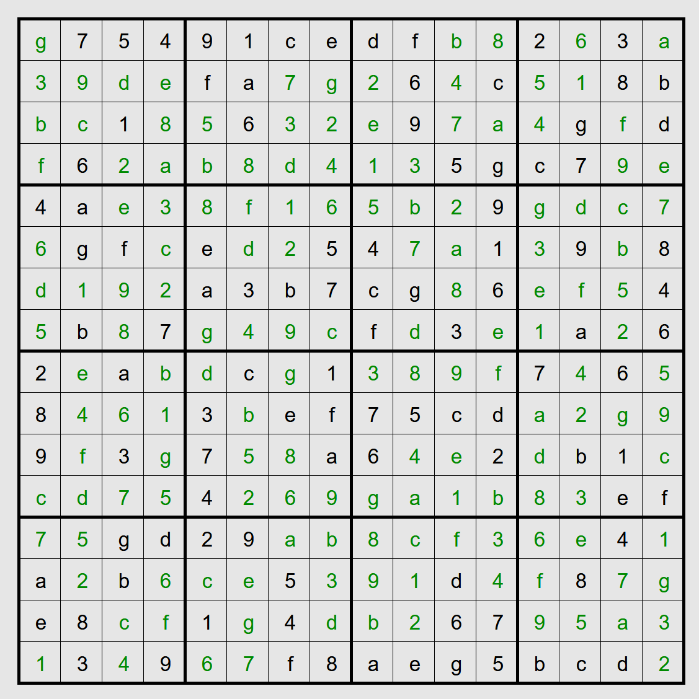

---

## Light Up (Puzzle Type #3)

* [**Play online**](https://www.chiark.greenend.org.uk/~sgtatham/puzzles/js/lightup.html)

* [**Instructions**](https://www.chiark.greenend.org.uk/~sgtatham/puzzles/doc/lightup.html#lightup)

**Unsolved puzzle**

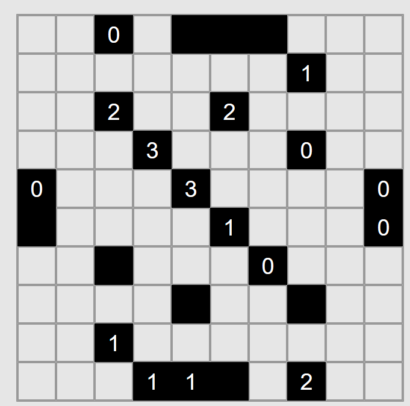

Code to utilize this package and solve the puzzle:
```python
import numpy as np
from . import board
bor = np.array([
  ['*', '0', '*', '*', '*', '*', 'W', '*', '*', '*'],
  ['*', '*', '*', '0', '*', '*', '*', '*', '*', '1'],
  ['W', '*', 'W', '*', '*', 'W', '*', '*', '0', '*'],
  ['0', '*', '*', '*', '3', '*', 'W', '*', '0', '*'],
  ['*', '*', '*', '*', 'W', '*', '2', '*', 'W', '*'],
  ['*', '1', '*', 'W', '*', '2', '*', '*', '*', '*'],
  ['*', '0', '*', 'W', '*', 'W', '*', '*', '*', 'W'],
  ['*', '0', '*', '*', '1', '*', '*', '2', '*', 'W'],
  ['0', '*', '*', '*', '*', '*', '1', '*', '*', '*'],
  ['*', '*', '*', '2', '*', '*', '*', '*', 'W', '*'],
])  # W is wall, * is space, # is number

binst = board.Board(board=bor)
solutions = binst.solve_and_print()
```
**Script Output**
```
Solution found
[[' ' '0' ' ' ' ' ' ' 'L' 'W' ' ' ' ' 'L']
 ['L' ' ' ' ' '0' ' ' ' ' 'L' ' ' ' ' '1']
 ['W' 'L' 'W' ' ' 'L' 'W' ' ' ' ' '0' ' ']
 ['0' ' ' ' ' 'L' '3' 'L' 'W' ' ' '0' ' ']
 [' ' ' ' 'L' ' ' 'W' ' ' '2' 'L' 'W' 'L']
 ['L' '1' ' ' 'W' 'L' '2' 'L' ' ' ' ' ' ']
 [' ' '0' ' ' 'W' ' ' 'W' ' ' ' ' ' ' 'W']
 [' ' '0' ' ' ' ' '1' 'L' ' ' '2' 'L' 'W']
 ['0' ' ' ' ' 'L' ' ' ' ' '1' 'L' ' ' ' ']
 [' ' 'L' ' ' '2' 'L' ' ' ' ' ' ' 'W' 'L']]
Solutions found: 1
status: OPTIMAL
```

**Solved puzzle**

Which exactly matches the true solutions (Remember, the goal of the puzzle is to find where to place the lights, marked as 'L' in the solution above):


---

## Tents (Puzzle Type #4)

* [**Play online**](https://www.chiark.greenend.org.uk/~sgtatham/puzzles/js/tents.html)

* [**Instructions**](https://www.chiark.greenend.org.uk/~sgtatham/puzzles/doc/tents.html#tents)

**Unsolved puzzle**


Code to utilize this package and solve the puzzle:
```python
import numpy as np
from . import board
bor = np.array([
  ['*', 'T', '*', '*', '*', '*', '*', '*', 'T', '*', 'T', '*', 'T', '*', '*'],
  ['*', '*', '*', '*', 'T', '*', '*', 'T', '*', 'T', '*', '*', 'T', '*', '*'],
  ['*', 'T', '*', 'T', '*', '*', '*', '*', '*', '*', '*', '*', '*', '*', '*'],
  ['*', '*', '*', '*', '*', '*', '*', '*', 'T', '*', '*', '*', 'T', '*', 'T'],
  ['*', '*', '*', '*', '*', '*', '*', '*', '*', '*', '*', '*', '*', '*', '*'],
  ['*', 'T', '*', '*', 'T', '*', 'T', '*', '*', 'T', '*', '*', 'T', 'T', '*'],
  ['*', 'T', '*', '*', 'T', '*', '*', '*', 'T', '*', '*', '*', '*', '*', '*'],
  ['*', '*', '*', '*', '*', '*', 'T', '*', '*', '*', '*', '*', '*', '*', '*'],
  ['*', '*', '*', '*', '*', 'T', '*', '*', '*', '*', 'T', '*', '*', 'T', '*'],
  ['*', '*', '*', 'T', '*', '*', '*', '*', '*', '*', '*', '*', 'T', '*', 'T'],
  ['T', '*', '*', '*', '*', '*', '*', 'T', '*', '*', '*', 'T', '*', '*', '*'],
  ['T', '*', '*', '*', 'T', '*', 'T', '*', '*', '*', '*', '*', '*', '*', '*'],
  ['*', '*', '*', '*', '*', '*', '*', '*', 'T', '*', 'T', '*', '*', '*', 'T'],
  ['*', 'T', '*', '*', '*', 'T', '*', '*', '*', '*', '*', '*', 'T', '*', '*'],
  ['*', 'T', '*', '*', 'T', '*', '*', '*', '*', 'T', '*', 'T', '*', '*', '*'],
])
side = np.array([4, 1, 6, 0, 5, 2, 3, 1, 5, 2, 3, 2, 4, 3, 4])
top = np.array([4, 2, 4, 1, 3, 3, 3, 3, 3, 3, 2, 2, 6, 2, 4])

binst = board.Board(board=bor, sides={'top': top, 'side': side})
solutions = binst.solve_and_print()
```
**Script Output**
```
Solution found
[[' ' 'T' 'E' ' ' ' ' ' ' ' ' 'E' 'T' ' ' 'T' 'E' 'T' 'E' ' ']
 [' ' ' ' ' ' ' ' 'T' 'E' ' ' 'T' ' ' 'T' ' ' ' ' 'T' ' ' ' ']
 ['E' 'T' 'E' 'T' ' ' ' ' ' ' 'E' ' ' 'E' ' ' ' ' 'E' ' ' 'E']
 [' ' ' ' ' ' ' ' ' ' ' ' ' ' ' ' 'T' ' ' ' ' ' ' 'T' ' ' 'T']
 [' ' 'E' ' ' ' ' 'E' ' ' 'E' ' ' 'E' ' ' ' ' ' ' 'E' ' ' ' ']
 [' ' 'T' ' ' ' ' 'T' ' ' 'T' ' ' ' ' 'T' 'E' ' ' 'T' 'T' 'E']
 [' ' 'T' ' ' ' ' 'T' 'E' ' ' 'E' 'T' ' ' ' ' ' ' 'E' ' ' ' ']
 [' ' 'E' ' ' ' ' ' ' ' ' 'T' ' ' ' ' ' ' ' ' ' ' ' ' ' ' ' ']
 [' ' ' ' ' ' ' ' 'E' 'T' 'E' ' ' ' ' 'E' 'T' ' ' 'E' 'T' 'E']
 ['E' ' ' 'E' 'T' ' ' ' ' ' ' ' ' ' ' ' ' ' ' ' ' 'T' ' ' 'T']
 ['T' ' ' ' ' ' ' ' ' ' ' ' ' 'T' 'E' ' ' ' ' 'T' 'E' ' ' 'E']
 ['T' ' ' ' ' 'E' 'T' 'E' 'T' ' ' ' ' ' ' ' ' ' ' ' ' ' ' ' ']
 ['E' ' ' ' ' ' ' ' ' ' ' ' ' ' ' 'T' 'E' 'T' 'E' ' ' 'E' 'T']
 [' ' 'T' 'E' ' ' 'E' 'T' 'E' ' ' ' ' ' ' ' ' ' ' 'T' ' ' ' ']
 ['E' 'T' ' ' ' ' 'T' ' ' ' ' ' ' 'E' 'T' 'E' 'T' 'E' ' ' ' ']]
Solutions found: 1
status: OPTIMAL
```

**Solved puzzle**


---

## Filling (Puzzle Type #5)

(Note: The solver for this puzzle is only extremely slow one in this repo and will take a minute to solve a simple 6x7 puzzle)

* [**Play online**](https://www.chiark.greenend.org.uk/~sgtatham/puzzles/js/filling.html)

* [**Instructions**](https://www.chiark.greenend.org.uk/~sgtatham/puzzles/doc/filling.html#filling)

**Unsolved puzzle**

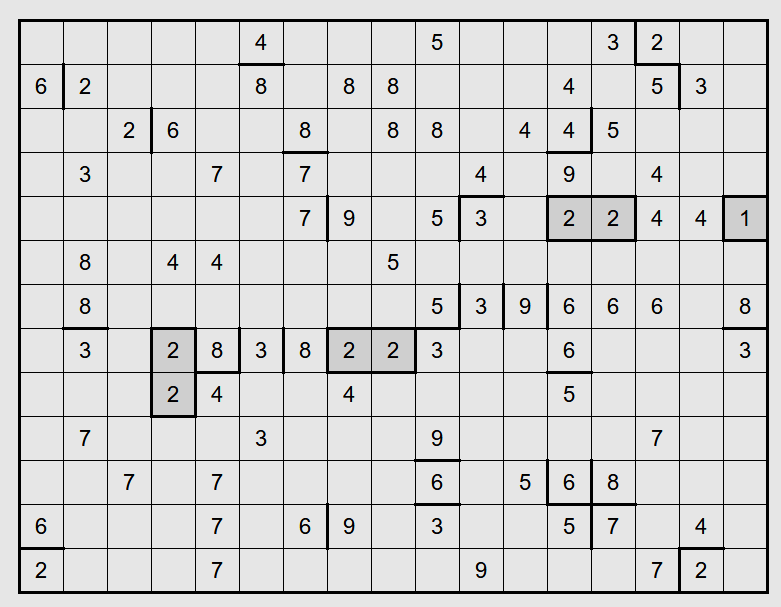

Code to utilize this package and solve the puzzle:
```python
import numpy as np
from . import board
bor = np.array([
  ['*', '4', '2', '*', '*', '2', '*'],
  ['*', '*', '7', '*', '*', '3', '*'],
  ['*', '*', '*', '*', '4', '*', '3'],
  ['*', '6', '6', '*', '3', '*', '*'],
  ['*', '7', '*', '6', '4', '5', '*'],
  ['*', '6', '*', '*', '*', '*', '4'],
])
binst = board.Board(board=bor)
solutions = binst.solve_and_print()
assert len(solutions) == 1, f'unique solutions != 1, == {len(solutions)}'
```
**Script Output**
```
Solution found
[[4 4 2 2 4 2 2]
 [4 4 7 4 4 3 3]
 [7 7 7 3 4 5 3]
 [7 6 6 3 3 5 5]
 [7 7 6 6 4 5 5]
 [1 6 6 1 4 4 4]]
Solutions found: 1
status: OPTIMAL
```

**Solved puzzle**

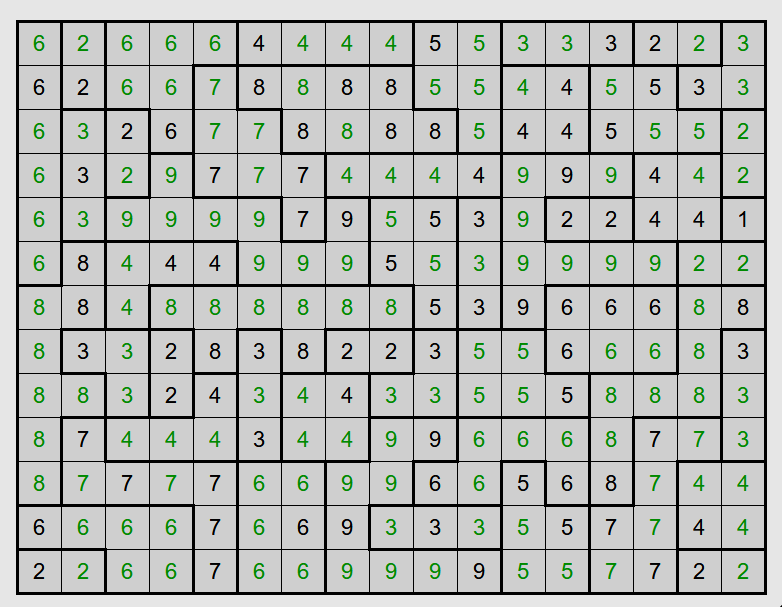

---

## Towers (Puzzle Type #6)

* [**Play online**](https://www.chiark.greenend.org.uk/~sgtatham/puzzles/js/towers.html)

* [**Instructions**](https://www.chiark.greenend.org.uk/~sgtatham/puzzles/doc/towers.html#towers)

**Unsolved puzzle**

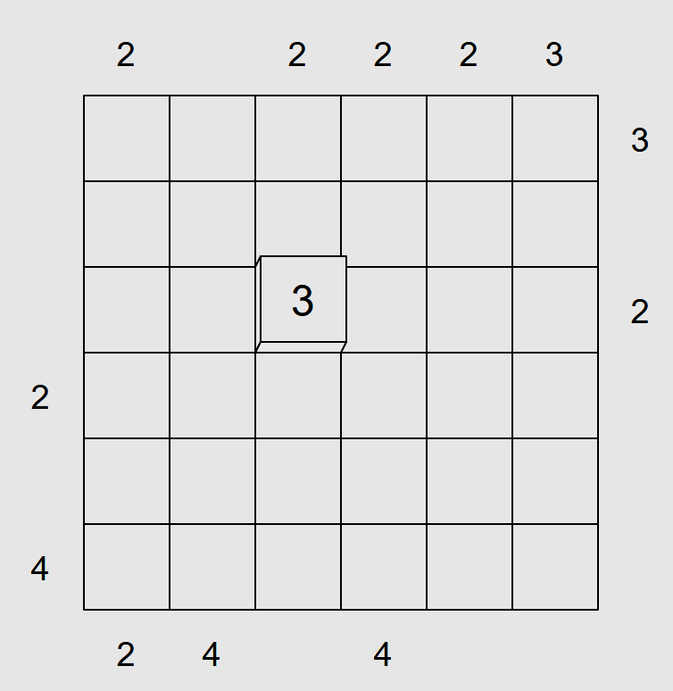

Code to utilize this package and solve the puzzle:
```python
import numpy as np
from . import board
bor = np.array([
  ['*', '*', '*', '*', '*', '*'],
  ['*', '*', '*', '*', '*', '*'],
  ['*', '*', '3', '*', '*', '*'],
  ['*', '*', '*', '*', '*', '*'],
  ['*', '*', '*', '*', '*', '*'],
  ['*', '*', '*', '*', '*', '*'],
])
t = np.array([2, -1, 2, 2, 2, 3])
b = np.array([2, 4, -1, 4, -1, -1])
r = np.array([3, -1, 2, -1, -1, -1])
l = np.array([-1, -1, -1, 2, -1, 4])
binst = board.Board(board=bor, sides={'top': t, 'bottom': b, 'right': r, 'left': l})
solutions = binst.solve_and_print()
```
**Script Output**
```
Solution found
[['5' '6' '4' '1' '2' '3']
 ['3' '4' '2' '6' '1' '5']
 ['4' '5' '3' '2' '6' '1']
 ['2' '1' '6' '5' '3' '4']
 ['6' '3' '1' '4' '5' '2']
 ['1' '2' '5' '3' '4' '6']]
Solutions found: 1
status: OPTIMAL
```

**Solved puzzle**

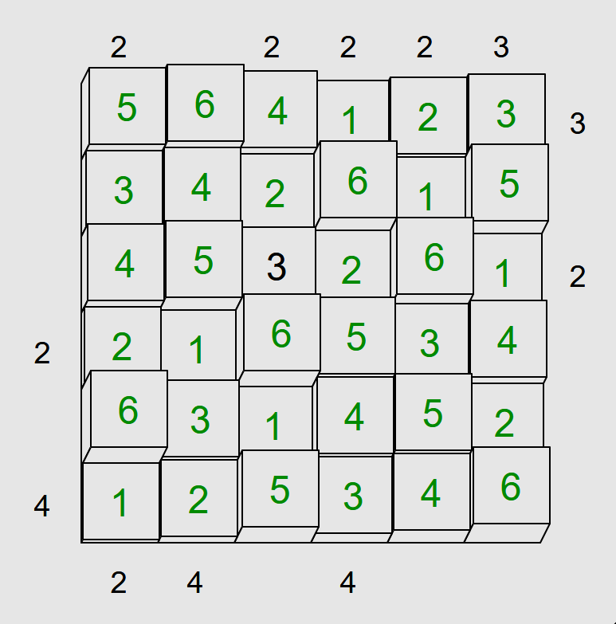

---

## Singles (Puzzle Type #7)

* [**Play online**](https://www.chiark.greenend.org.uk/~sgtatham/puzzles/js/single.html)

* [**Instructions**](https://www.chiark.greenend.org.uk/~sgtatham/puzzles/doc/single.html#single)

**Unsolved puzzle**


Code to utilize this package and solve the puzzle:
```python
import numpy as np
from . import board
bor = np.array([
  [1, 6, 5, 4, 9, 8, 9, 3, 5, 1, 3, 7],
  [2, 8, 5, 7, 1, 1, 4, 3, 6, 3, 10, 7],
  [6, 7, 7, 11, 2, 6, 3, 10, 10, 2, 3, 3],
  [11, 9, 4, 3, 6, 1, 2, 5, 3, 10, 7, 8], 
  [5, 5, 4, 9, 7, 9, 6, 6, 11, 5, 4, 11],
  [1, 3, 7, 9, 12, 5, 4, 2, 9, 6, 12, 4],
  [6, 11, 1, 3, 6, 4, 11, 2, 2, 10, 8, 10],
  [3, 11, 12, 6, 2, 9, 9, 1, 4, 8, 12, 5],
  [4, 8, 8, 5, 11, 3, 3, 6, 5, 9, 1, 4],
  [2, 4, 6, 2, 1, 10, 1, 10, 8, 5, 4, 6],
  [5, 1, 6, 10, 9, 4, 8, 4, 8, 3, 2, 12],
  [11, 2, 12, 10, 8, 3, 5, 4, 10, 4, 8, 11],
])
binst = board.Board(board=bor)
solutions = binst.solve_and_print()
```
**Script Output**
```
Solution found
[['B' ' ' 'B' ' ' 'B' ' ' ' ' 'B' ' ' ' ' ' ' ' ']
 [' ' ' ' ' ' ' ' ' ' 'B' ' ' ' ' ' ' 'B' ' ' 'B']
 ['B' ' ' 'B' ' ' 'B' ' ' 'B' ' ' 'B' ' ' 'B' ' ']
 [' ' ' ' ' ' 'B' ' ' ' ' ' ' ' ' ' ' ' ' ' ' ' ']
 ['B' ' ' 'B' ' ' ' ' 'B' ' ' 'B' ' ' 'B' ' ' 'B']
 [' ' ' ' ' ' 'B' ' ' ' ' 'B' ' ' ' ' ' ' 'B' ' ']
 [' ' 'B' ' ' ' ' 'B' ' ' ' ' 'B' ' ' 'B' ' ' ' ']
 [' ' ' ' 'B' ' ' ' ' ' ' 'B' ' ' ' ' ' ' ' ' ' ']
 [' ' 'B' ' ' ' ' ' ' 'B' ' ' ' ' 'B' ' ' ' ' 'B']
 ['B' ' ' 'B' ' ' 'B' ' ' ' ' 'B' ' ' ' ' 'B' ' ']
 [' ' ' ' ' ' ' ' ' ' 'B' ' ' ' ' 'B' ' ' ' ' ' ']
 ['B' ' ' ' ' 'B' ' ' ' ' ' ' 'B' ' ' ' ' 'B' ' ']]
Solutions found: 1
status: OPTIMAL
```

**Solved puzzle**


---

## Magnets (Puzzle Type #8)

* [**Play online**](https://www.chiark.greenend.org.uk/~sgtatham/puzzles/js/magnets.html)

* [**Instructions**](https://www.chiark.greenend.org.uk/~sgtatham/puzzles/doc/magnets.html#magnets)

**Unsolved puzzle**

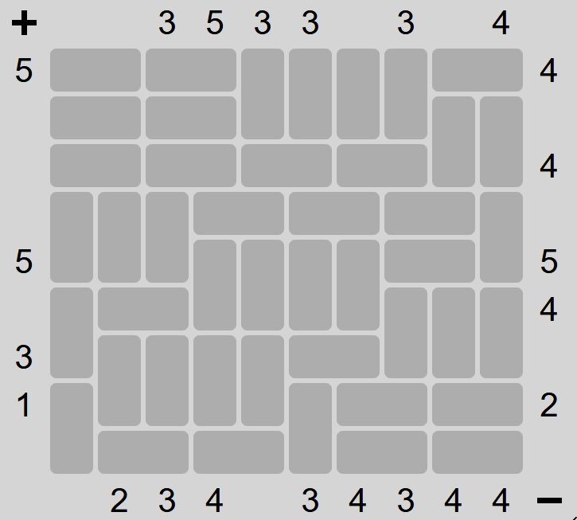

Code to utilize this package and solve the puzzle:
```python
import numpy as np
from . import board
bor = np.array([
  ['H', 'H', 'H', 'H', 'V', 'V', 'V', 'V', 'H', 'H'],
  ['H', 'H', 'H', 'H', 'V', 'V', 'V', 'V', 'V', 'V'],
  ['H', 'H', 'H', 'H', 'H', 'H', 'H', 'H', 'V', 'V'],
  ['V', 'V', 'V', 'H', 'H', 'H', 'H', 'H', 'H', 'V'],
  ['V', 'V', 'V', 'V', 'V', 'V', 'V', 'H', 'H', 'V'],
  ['V', 'H', 'H', 'V', 'V', 'V', 'V', 'V', 'V', 'V'],
  ['V', 'V', 'V', 'V', 'V', 'H', 'H', 'V', 'V', 'V'],
  ['V', 'V', 'V', 'V', 'V', 'V', 'H', 'H', 'H', 'H'],
  ['V', 'H', 'H', 'H', 'H', 'V', 'H', 'H', 'H', 'H'],
])
pos_v = np.array([-1, -1, 3, 5, 3, 3, -1, 3, -1, 4])
neg_v = np.array([-1, 2, 3, 4, -1, 3, 4, 3, 4, 4])
pos_h = np.array([5, -1, -1, -1, 5, -1, 3, 1, -1])
neg_h = np.array([4, -1, 4, -1, 5, 4, -1, 2, -1])

binst = board.Board(board=bor, sides={'pos_v': pos_v, 'neg_v': neg_v, 'pos_h': pos_h, 'neg_h': neg_h})
solutions = binst.solve_and_print()
```
**Script Output**
```
Solution found
[['-' '+' '-' '+' ' ' '+' '-' '+' '-' '+']
 [' ' ' ' '+' '-' ' ' '-' '+' '-' '+' '-']
 ['-' '+' '-' '+' ' ' ' ' '-' '+' '-' '+']
 ['+' '-' '+' '-' '+' '-' '+' '-' '+' '-']
 ['-' '+' '-' '+' '-' '+' '-' '+' '-' '+']
 [' ' '-' '+' '-' '+' '-' '+' ' ' '+' '-']
 [' ' ' ' ' ' '+' '-' '+' '-' ' ' '-' '+']
 ['-' ' ' ' ' '-' '+' ' ' ' ' ' ' ' ' ' ']
 ['+' ' ' ' ' '+' '-' ' ' '+' '-' '+' '-']]
Solutions found: 1
status: OPTIMAL
```

**Solved puzzle**

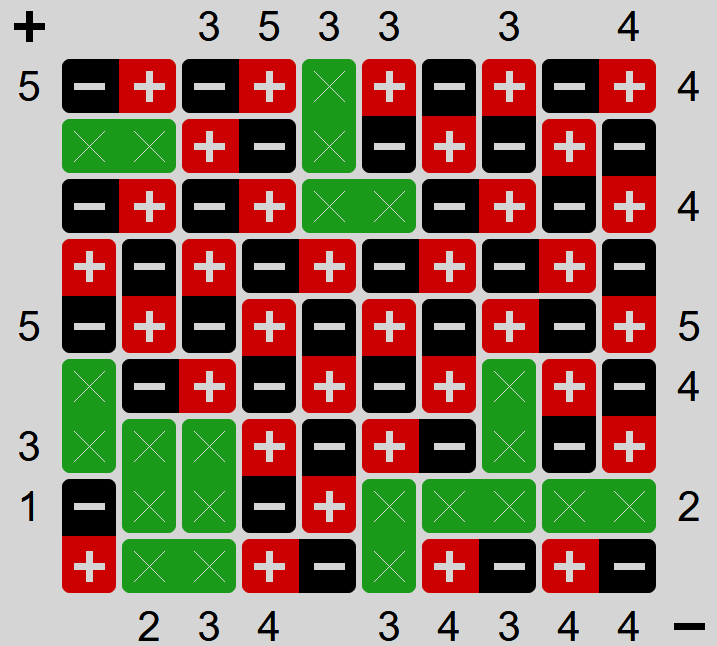


---

## Range (Puzzle Type #9)

(Note: The solver for this puzzle is slightly slower and could take several seconds to solve a 16x11 puzzle)

* [**Play online**](https://www.chiark.greenend.org.uk/~sgtatham/puzzles/js/range.html)

* [**Instructions**](https://www.chiark.greenend.org.uk/~sgtatham/puzzles/doc/range.html#range)

**Unsolved puzzle**

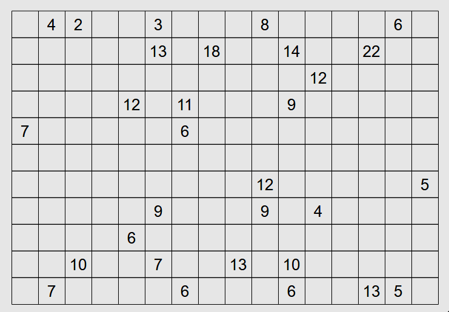

Code to utilize this package and solve the puzzle:
```python
import numpy as np
from . import board
clues = np.array([
    [-1, 4, 2, -1, -1, 3, -1, -1, -1, 8, -1, -1, -1, -1, 6, -1],
    [-1, -1, -1, -1, -1, 13, -1, 18, -1, -1, 14, -1, -1, 22, -1, -1],
    [-1, -1, -1, -1, -1, -1, -1, -1, -1, -1, -1, 12, -1, -1, -1, -1],
    [-1, -1, -1, -1, 12, -1, 11, -1, -1, -1, 9, -1, -1, -1, -1, -1],
    [7, -1, -1, -1, -1, -1, 6, -1, -1, -1, -1, -1, -1, -1, -1, -1],
    [-1, -1, -1, -1, -1, -1, -1, -1, -1, -1, -1, -1, -1, -1, -1, -1],
    [-1, -1, -1, -1, -1, -1, -1, -1, -1, 12, -1, -1, -1, -1, -1, 5],
    [-1, -1, -1, -1, -1, 9, -1, -1, -1, 9, -1, 4, -1, -1, -1, -1],
    [-1, -1, -1, -1, 6, -1, -1, -1, -1, -1, -1, -1, -1, -1, -1, -1],
    [-1, -1, 10, -1, -1, 7, -1, -1, 13, -1, 10, -1, -1, -1, -1, -1],
    [-1, 7, -1, -1, -1, -1, 6, -1, -1, -1, 6, -1, -1, 13, 5, -1],
])
board = board.Board(clues)
sols = board.solve_and_print()
```
**Script Output**
```
Solution:
B . . B . . B . B . B . B . . .
. . B . . . . . . . . . . . . B
B . . . . B . . . . . . . . . .
. B . B . . . . . . . B . . . .
. . . . . B . . B . B . . . B .
. . B . . . . . . . . B . . . B
B . . . B . B . . . . . B . . .
. . . . . . . B . . B . . . B .
. B . . . B . . . B . B . . . .
. . . . . . B . . . . . . . . B
B . . . . . . B . . . . B . . .
Solutions found: 1
status: OPTIMAL
```

**Solved puzzle**

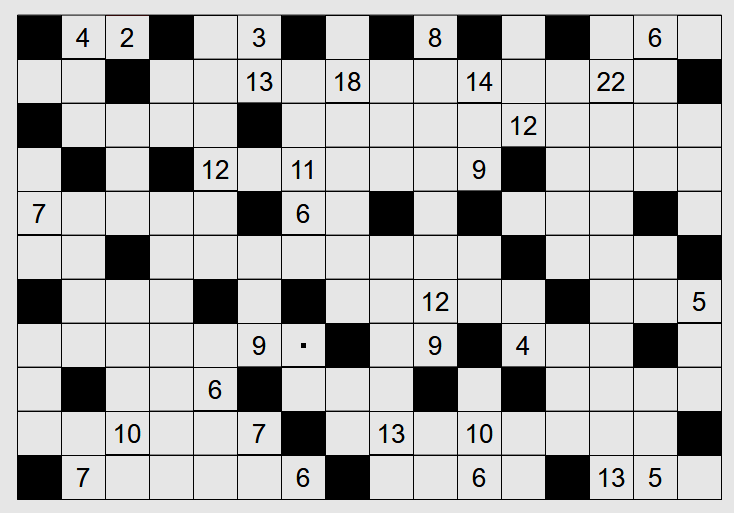

---

## UnDead (Puzzle Type #10)

* [**Play online**](https://www.chiark.greenend.org.uk/~sgtatham/puzzles/js/undead.html)

* [**Instructions**](https://www.chiark.greenend.org.uk/~sgtatham/puzzles/doc/undead.html#undead)

**Unsolved puzzle**

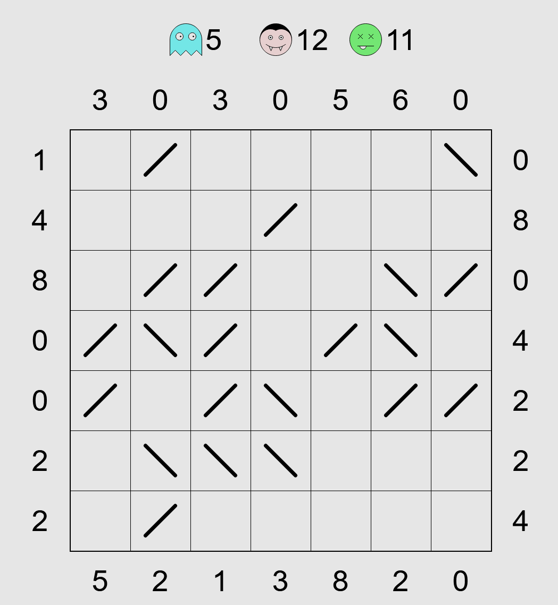

Code to utilize this package and solve the puzzle:
```python
import numpy as np
from . import board
bor = np.array([
  ['**', '//', '**', '**', '**', '**', '\\'],
  ['**', '**', '**', '//', '**', '**', '**'],
  ['**', '//', '//', '**', '**', '\\', '//'],
  ['//', '\\', '//', '**', '//', '\\', '**'],
  ['//', '**', '//', '\\', '**', '//', '//'],
  ['**', '\\', '\\', '\\', '**', '**', '**'],
  ['**', '//', '**', '**', '**', '**', '**'],
])
t = np.array([3, 0, 3, 0, 5, 6, 0])
b = np.array([5, 2, 1, 3, 8, 2, 0])
r = np.array([0, 8, 0, 4, 2, 2, 4])
l = np.array([1, 4, 8, 0, 0, 2, 2])
counts = {Monster.GHOST: 5, Monster.VAMPIRE: 12, Monster.ZOMBIE: 11}

# create board and solve
binst = board.Board(board=bor, sides={'top': t, 'bottom': b, 'right': r, 'left': l}, monster_count=counts)
solutions = binst.solve_and_print()
```
**Script Output**
```
Solution found
[['VA' '//' 'GH' 'GH' 'ZO' 'GH' '\\']
 ['VA' 'VA' 'VA' '//' 'ZO' 'ZO' 'ZO']
 ['VA' '//' '//' 'ZO' 'ZO' '\\' '//']
 ['//' '\\' '//' 'VA' '//' '\\' 'VA']
 ['//' 'VA' '//' '\\' 'ZO' '//' '//']
 ['ZO' '\\' '\\' '\\' 'ZO' 'VA' 'GH']
 ['ZO' '//' 'VA' 'VA' 'ZO' 'VA' 'GH']]
Solutions found: 1
status: OPTIMAL
```

**Solved puzzle**

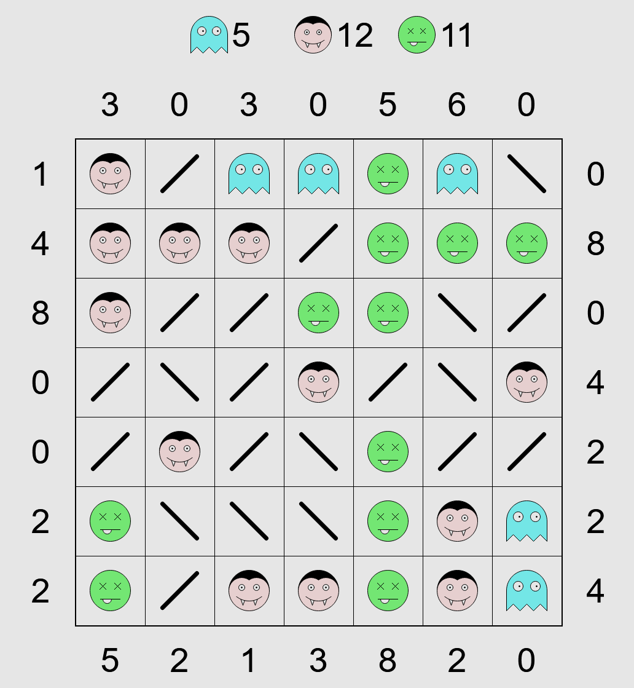

---

## Unruly (Puzzle Type #11)

* [**Play online**](https://www.chiark.greenend.org.uk/~sgtatham/puzzles/js/unruly.html)

* [**Instructions**](https://www.chiark.greenend.org.uk/~sgtatham/puzzles/doc/unruly.html#unruly)

**Unsolved puzzle**

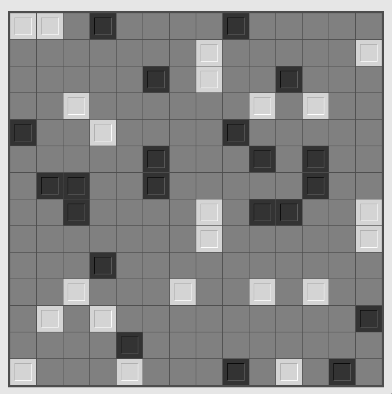

Code to utilize this package and solve the puzzle:
```python
import numpy as np
from . import board
bor = np.array([
  ['W', 'W', '*', 'B', '*', '*', '*', '*', 'B', '*', '*', '*', '*', '*'],
  ['*', '*', '*', '*', '*', '*', '*', 'W', '*', '*', '*', '*', '*', 'W'],
  ['*', '*', '*', '*', '*', 'B', '*', 'W', '*', '*', 'B', '*', '*', '*'],
  ['*', '*', 'W', '*', '*', '*', '*', '*', '*', 'W', '*', 'W', '*', '*'],
  ['B', '*', '*', 'W', '*', '*', '*', '*', 'B', '*', '*', '*', '*', '*'],
  ['*', '*', '*', '*', '*', 'B', '*', '*', '*', 'B', '*', 'B', '*', '*'],
  ['*', 'B', 'B', '*', '*', 'B', '*', '*', '*', '*', '*', 'B', '*', '*'],
  ['*', '*', 'B', '*', '*', '*', '*', 'W', '*', 'B', 'B', '*', '*', 'W'],
  ['*', '*', '*', '*', '*', '*', '*', 'W', '*', '*', '*', '*', '*', 'W'],
  ['*', '*', '*', 'B', '*', '*', '*', '*', '*', '*', '*', '*', '*', '*'],
  ['*', '*', 'W', '*', '*', '*', 'W', '*', '*', 'W', '*', 'W', '*', '*'],
  ['*', 'W', '*', 'W', '*', '*', '*', '*', '*', '*', '*', '*', '*', 'B'],
  ['*', '*', '*', '*', 'B', '*', '*', '*', '*', '*', '*', '*', '*', '*'],
  ['W', '*', '*', '*', 'W', '*', '*', '*', 'B', '*', 'W', '*', 'B', '*'],
])
binst = board.Board(board=bor)
solutions = binst.solve_and_print()
```
**Script Output**
```
Solution found
[['W' 'W' 'B' 'B' 'W' 'B' 'W' 'B' 'B' 'W' 'B' 'W' 'W' 'B']
 ['B' 'B' 'W' 'W' 'B' 'W' 'B' 'W' 'W' 'B' 'W' 'B' 'B' 'W']
 ['W' 'W' 'B' 'W' 'W' 'B' 'B' 'W' 'B' 'W' 'B' 'B' 'W' 'B']
 ['W' 'B' 'W' 'B' 'B' 'W' 'W' 'B' 'W' 'W' 'B' 'W' 'B' 'B']
 ['B' 'W' 'B' 'W' 'B' 'W' 'B' 'W' 'B' 'B' 'W' 'W' 'B' 'W']
 ['B' 'W' 'W' 'B' 'W' 'B' 'B' 'W' 'B' 'B' 'W' 'B' 'W' 'W']
 ['W' 'B' 'B' 'W' 'W' 'B' 'W' 'B' 'W' 'W' 'B' 'B' 'W' 'B']
 ['B' 'W' 'B' 'W' 'B' 'W' 'B' 'W' 'W' 'B' 'B' 'W' 'B' 'W']
 ['B' 'B' 'W' 'B' 'B' 'W' 'B' 'W' 'B' 'W' 'W' 'B' 'W' 'W']
 ['W' 'W' 'B' 'B' 'W' 'B' 'W' 'B' 'W' 'B' 'W' 'W' 'B' 'B']
 ['B' 'B' 'W' 'W' 'B' 'W' 'W' 'B' 'B' 'W' 'B' 'W' 'B' 'W']
 ['B' 'W' 'B' 'W' 'W' 'B' 'B' 'W' 'W' 'B' 'W' 'B' 'W' 'B']
 ['W' 'B' 'W' 'B' 'B' 'W' 'W' 'B' 'W' 'B' 'B' 'W' 'W' 'B']
 ['W' 'B' 'W' 'B' 'W' 'B' 'W' 'B' 'B' 'W' 'W' 'B' 'B' 'W']]
Solutions found: 1
status: OPTIMAL
```

**Solved puzzle**

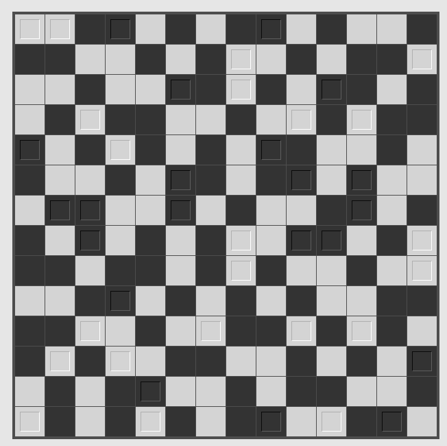

---

## Mosaic (Puzzle Type #12)

* [**Play online**](https://www.chiark.greenend.org.uk/~sgtatham/puzzles/js/mosaic.html)

* [**Instructions**](https://www.chiark.greenend.org.uk/~sgtatham/puzzles/doc/mosaic.html#mosaic)

**Unsolved puzzle**

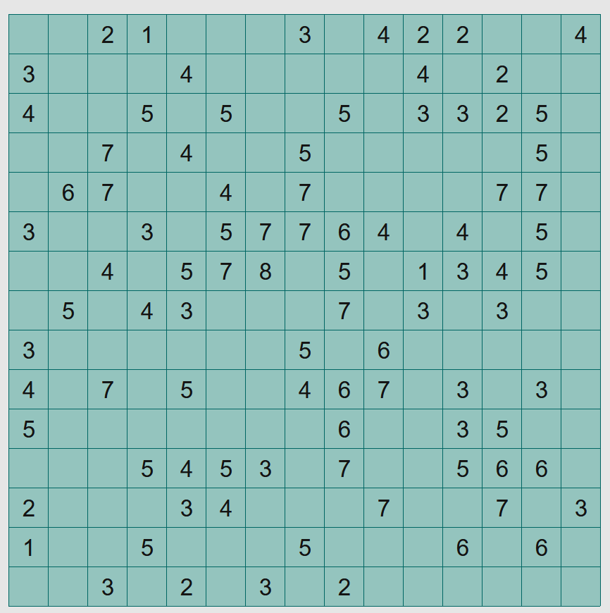

Code to utilize this package and solve the puzzle:
```python
import numpy as np
from . import board
bor = np.array([
  ['*', '*', '2', '1', '*', '*', '*', '3', '*', '4', '2', '2', '*', '*', '4'],
  ['3', '*', '*', '*', '4', '*', '*', '*', '*', '*', '4', '*', '2', '*', '*'],
  ['4', '*', '*', '5', '*', '5', '*', '*', '5', '*', '3', '3', '2', '5', '*'],
  ['*', '*', '7', '*', '4', '*', '*', '5', '*', '*', '*', '*', '*', '5', '*'],
  ['*', '6', '7', '*', '*', '4', '*', '7', '*', '*', '*', '*', '7', '7', '*'],
  ['3', '*', '*', '3', '*', '5', '7', '7', '6', '4', '*', '4', '*', '5', '*'],
  ['*', '*', '4', '*', '5', '7', '8', '*', '5', '*', '1', '3', '4', '5', '*'],
  ['*', '5', '*', '4', '3', '*', '*', '*', '7', '*', '3', '*', '3', '*', '*'],
  ['3', '*', '*', '*', '*', '*', '*', '5', '*', '6', '*', '*', '*', '*', '*'],
  ['4', '*', '7', '*', '5', '*', '*', '4', '6', '7', '*', '3', '*', '3', '*'],
  ['5', '*', '*', '*', '*', '*', '*', '*', '6', '*', '*', '3', '5', '*', '*'],
  ['*', '*', '*', '5', '4', '5', '3', '*', '7', '*', '*', '5', '6', '6', '*'],
  ['2', '*', '*', '*', '3', '4', '*', '*', '*', '7', '*', '*', '7', '*', '3'],
  ['1', '*', '*', '5', '*', '*', '*', '5', '*', '*', '*', '6', '*', '6', '*'],
  ['*', '*', '3', '*', '2', '*', '3', '*', '2', '*', '*', '*', '*', '*', '*']
])
binst = board.Board(board=bor)
solutions = binst.solve_and_print()
```
**Script Output**
```
Solution found
[[' ' 'B' ' ' ' ' ' ' ' ' ' ' ' ' 'B' ' ' 'B' ' ' ' ' 'B' 'B']
 [' ' 'B' ' ' ' ' 'B' 'B' ' ' 'B' 'B' ' ' 'B' ' ' ' ' 'B' 'B']
 [' ' 'B' 'B' ' ' 'B' 'B' ' ' ' ' ' ' 'B' 'B' ' ' ' ' ' ' 'B']
 ['B' 'B' 'B' 'B' ' ' ' ' 'B' 'B' 'B' ' ' ' ' ' ' 'B' ' ' 'B']
 [' ' 'B' 'B' ' ' ' ' 'B' ' ' 'B' 'B' 'B' ' ' 'B' 'B' 'B' ' ']
 [' ' 'B' ' ' 'B' ' ' 'B' 'B' ' ' 'B' ' ' ' ' 'B' 'B' 'B' 'B']
 ['B' ' ' 'B' ' ' ' ' 'B' 'B' 'B' 'B' ' ' ' ' ' ' ' ' ' ' ' ']
 [' ' ' ' 'B' ' ' 'B' 'B' 'B' 'B' 'B' ' ' ' ' ' ' 'B' ' ' 'B']
 [' ' 'B' 'B' ' ' ' ' ' ' ' ' 'B' 'B' 'B' 'B' 'B' ' ' 'B' ' ']
 ['B' 'B' 'B' 'B' 'B' 'B' ' ' ' ' ' ' 'B' 'B' ' ' ' ' 'B' ' ']
 [' ' 'B' ' ' 'B' 'B' ' ' 'B' ' ' 'B' 'B' ' ' ' ' ' ' 'B' ' ']
 ['B' 'B' ' ' ' ' 'B' ' ' ' ' 'B' 'B' 'B' ' ' 'B' 'B' 'B' 'B']
 [' ' ' ' 'B' ' ' 'B' ' ' 'B' ' ' 'B' 'B' 'B' 'B' 'B' ' ' 'B']
 [' ' ' ' 'B' 'B' ' ' ' ' 'B' ' ' 'B' 'B' ' ' 'B' 'B' ' ' ' ']
 ['B' ' ' 'B' ' ' ' ' 'B' 'B' ' ' ' ' ' ' ' ' ' ' 'B' 'B' 'B']]
Solutions found: 1
status: OPTIMAL
```

**Solved puzzle**

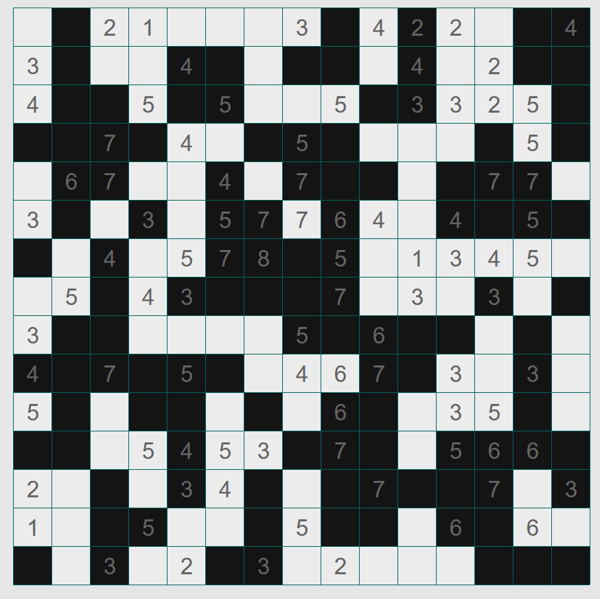

---

---

## Quick Start

### 1) Install Python deps

Use a fresh conda environment:

```bash
conda create -p ./env python=3.11
conda activate ./env
pip install -r requirements.txt
````

### 2) Explore a puzzle

Each chapter has runnable scripts and importable modules.

Example: Nonograms (Pattern)
Docs: [https://www.chiark.greenend.org.uk/~sgtatham/puzzles/doc/pattern.html#pattern](https://www.chiark.greenend.org.uk/~sgtatham/puzzles/doc/pattern.html#pattern)

```bash
python -m chapter10_nonograms.test_solve
```

This runs code like:

```python
from . import board
top_numbers = [
  [8, 2],
  ...
  [1, 5],
]  # top clues, omitted here for brevity
side_numbers = [
  [7, 3],
  ...
  [3, 2],
]  # side clues, omitted here for brevity
binst = board.Board(top=top_numbers, side=side_numbers)
solutions = binst.solve_and_print()
```

You’ll see the solution grid and status in the terminal.

---

## Testing

To run the tests, simply follow the instructions in Install Python deps section ([here](#1-install-python-deps)) and then run:

```python -m pytest --import-mode=importlib```

## Contributing

Issues and PRs welcome!


* Python 3.11 recommended.
* Keep puzzle folders self-contained (inputs, solver, simple demo/CLI).
* Prefer small, readable encodings with comments explaining each constraint.
* If you add a new puzzle:

  1. Create `chapterXX_<name>/`,
  2. Add a minimal test script,
  3. Document the modeling in code comments,


[1]: https://github.com/Ar-Kareem/SAT_puzzle_solver/tree/master/chapter10_nonograms "SAT_puzzle_solver/chapter10_nonograms at master · Ar-Kareem/SAT_puzzle_solver · GitHub"
[2]: https://github.com/Ar-Kareem/SAT_puzzle_solver/tree/master/chapter11_sudoku "SAT_puzzle_solver/chapter11_sudoku at master · Ar-Kareem/SAT_puzzle_solver · GitHub"
[3]: https://github.com/Ar-Kareem/SAT_puzzle_solver/tree/master/chapter21_light_up "SAT_puzzle_solver/chapter21_light_up at master · Ar-Kareem/SAT_puzzle_solver · GitHub"
[4]: https://github.com/Ar-Kareem/SAT_puzzle_solver/tree/master/chapter25_tents "SAT_puzzle_solver/chapter25_tents at master · Ar-Kareem/SAT_puzzle_solver · GitHub"
[5]: https://github.com/Ar-Kareem/SAT_puzzle_solver/tree/master/chapter29_filling "SAT_puzzle_solver/chapter29_filling at master · Ar-Kareem/SAT_puzzle_solver · GitHub"
[6]: https://github.com/Ar-Kareem/SAT_puzzle_solver/tree/master/chapter31_towers "SAT_puzzle_solver/chapter31_towers at master · Ar-Kareem/SAT_puzzle_solver · GitHub"
[7]: https://github.com/Ar-Kareem/SAT_puzzle_solver/tree/master/chapter32_single "SAT_puzzle_solver/chapter32_single at master · Ar-Kareem/SAT_puzzle_solver · GitHub"
[8]: https://github.com/Ar-Kareem/SAT_puzzle_solver/tree/master/chapter33_magnets "SAT_puzzle_solver/chapter33_magnets at master · Ar-Kareem/SAT_puzzle_solver · GitHub"
[9]: https://github.com/Ar-Kareem/SAT_puzzle_solver/tree/master/chapter35_range "SAT_puzzle_solver/chapter35_range at master · Ar-Kareem/SAT_puzzle_solver · GitHub"
[10]: https://github.com/Ar-Kareem/SAT_puzzle_solver/tree/master/chapter37_undead "SAT_puzzle_solver/chapter37_undead at master · Ar-Kareem/SAT_puzzle_solver · GitHub"
[11]: https://github.com/Ar-Kareem/SAT_puzzle_solver/tree/master/chapter38_unruly "SAT_puzzle_solver/chapter38_unruly at master · Ar-Kareem/SAT_puzzle_solver · GitHub"
[12]: https://github.com/Ar-Kareem/SAT_puzzle_solver/tree/master/chapter42_mosaic "SAT_puzzle_solver/chapter42_mosaic at master · Ar-Kareem/SAT_puzzle_solver · GitHub"