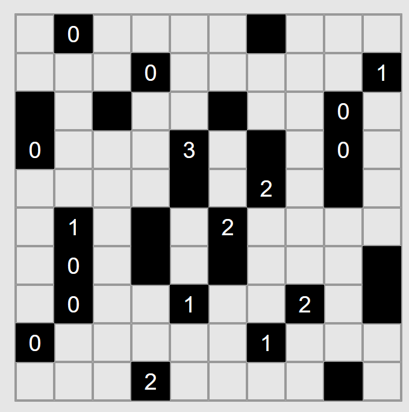

# SAT Puzzle Solver

This is a simple project solves classic logic puzzles by encoding them as SAT/CP-SAT problems in Python.

This repo collects small, focused solvers for different puzzle families, each living in its own folder with self-contained examples.

You can play the puzzles online here: https://www.chiark.greenend.org.uk/~sgtatham/puzzles

## Puzzles

Only a few puzzles in the website have solvers implemented here. Here we list them:

### Nonograms

Called "Pattern" in the website.

Game: https://www.chiark.greenend.org.uk/~sgtatham/puzzles/js/pattern.html

Instructions: https://www.chiark.greenend.org.uk/~sgtatham/puzzles/doc/pattern.html#pattern

Unsolved puzzle:


Code to utilize this package and solve the puzzle:
```python
import board
top_numbers = [
  [8, 2],
  ...
  [1, 5],
]  # top clues, ommited here for brevity
side_numbers = [
  [7, 3],
  ...
  [3, 2],
]  # side clues, ommited here for brevity
binst = board.Board(top=top_numbers, side=side_numbers)
solutions = binst.solve_and_print()
```
Output:
```
Solution found
B B B B B B B . B B B . . . .
B B B B B B B . . . . . B . B
B B . . . . . . . . . B B B .
B B . . . . . . . . . . B B B
B B B . . . . . . . . . . B B
B . . . B . B . . B . . . B B
B . . . . . B B B B B B . . B
B . . . . . B B B B B B B B B
. . . . . B B B B B B B B B .
. . . . . B B . B B B B . . .
. . . . B B B B B B B B . . .
B B B B B B B B B B B . . . .
B B B B B B B . . B . B . . .
. B B B B . . . . B B B . . .
. B B B . . . . . . . B B . .
Solutions found: 1
status: OPTIMAL
```

True solutions:


### Light Up

Game: https://www.chiark.greenend.org.uk/~sgtatham/puzzles/js/lightup.html

Instructions: https://www.chiark.greenend.org.uk/~sgtatham/puzzles/doc/lightup.html#lightup

Unsolved puzzle:



Code to utilize this package and solve the puzzle:
```python
import numpy as np
import board
bor = np.array([
  ['*', '*', '0', '*', 'W', 'W', 'W', '*', '*', '*'],
  ['*', '*', '*', '*', '*', '*', '*', '1', '*', '*'],
  ['*', '*', '2', '*', '*', '2', '*', '*', '*', '*'],
  ['*', '*', '*', '3', '*', '*', '*', '0', '*', '*'],
  ['0', '*', '*', '*', '3', '*', '*', '*', '*', '0'],
  ['W', '*', '*', '*', '*', '1', '*', '*', '*', '0'],
  ['*', '*', 'W', '*', '*', '*', '0', '*', '*', '*'],
  ['*', '*', '*', '*', 'W', '*', '*', 'W', '*', '*'],
  ['*', '*', '1', '*', '*', '*', '*', '*', '*', '*'],
  ['*', '*', '*', '1', '1', 'W', '*', '2', '*', '*'],
])

binst = board.Board(board=bor)
solutions = binst.solve_and_print()
```
Output:
```
Solution found
[['L' ' ' '0' ' ' 'W' 'W' 'W' 'L' ' ' ' ']
 [' ' ' ' ' ' ' ' ' ' 'L' ' ' '1' ' ' 'L']
 [' ' 'L' '2' 'L' ' ' '2' 'L' ' ' ' ' ' ']
 [' ' ' ' ' ' '3' 'L' ' ' ' ' '0' ' ' ' ']
 ['0' ' ' ' ' 'L' '3' 'L' ' ' ' ' ' ' '0']
 ['W' ' ' 'L' ' ' ' ' '1' ' ' 'L' ' ' '0']
 [' ' ' ' 'W' ' ' 'L' ' ' '0' ' ' ' ' ' ']
 ['L' ' ' ' ' ' ' 'W' 'L' ' ' 'W' ' ' 'L']
 [' ' ' ' '1' ' ' 'L' ' ' ' ' ' ' ' ' ' ']
 [' ' ' ' 'L' '1' '1' 'W' 'L' '2' 'L' ' ']]
Solutions found: 1
status: OPTIMAL
```

Which exactly matches the true solutions:


## What’s inside

Each chapter directory targets a different puzzle type:

* `chapter10_nonograms` — Picross/Griddlers (paint-by-numbers) via run-length constraints per row/column. ([Chapter 10][2])
* `chapter21_light_up` — *Akari* / Light Up (place bulbs so every white cell is lit; numbered blacks constrain adjacency). ([chapter 21][3])
* `chapter31_towers` — Skyscrapers (permutation rows/cols with “visible tower” counts). ([Chapter 31][4])
* `chapter33_magnets` — Magnets (place polarized dominoes to satisfy row/column + polarity counts). ([Chapter 33][5])
* `chapter37_undead` — UnDead / Count Vampires, Zombies, Ghosts (logic with neighborhood constraints). ([Chapter 37][6])
* `chapter42_mosaic` — Mosaic / Tapa-like numeric tiling constraints. ([Chapter 42][7])

## Why SAT / CP-SAT?

Many pencil puzzles can be modeled as:

* **Boolean decisions** (is this cell black/white? bulb/no-bulb?),
* **Linear constraints** (counts, separations, adjacency),
* **All-different / visibility / reachability** style constraints.

This repo uses Python to build those constraints and calls a SAT/CP-SAT solver (e.g., OR-Tools) to search efficiently.

## Quick start

### 1) Install Python deps

Use a fresh virtualenv/conda env:

```bash
conda create -p ./env python=3.11
conda activate ./env
pip install -r requirements.txt
```

### 2) Explore a puzzle

Each chapter folder contains Python scripts you can run directly or import as modules.

Here is an example to the chapter10 puzzle solver:

(instructions can be found here: https://www.chiark.greenend.org.uk/~sgtatham/puzzles/doc/pattern.html#pattern)

```bash
cd chapter10_nonograms
python test.py
```

Which will run the following code:
```python
import board
top_numbers = [
  [8, 2],
  ...
  [1, 5],
]  # top clues, ommited here for brevity
side_numbers = [
  [7, 3],
  ...
  [3, 2],
]  # side clues, ommited here for brevity
binst = board.Board(top=top_numbers, side=side_numbers)
solutions = binst.solve_and_print()
```

And attempt to solve the following nonogram puzzle:


And the output in the terminal will be:
```bash
$python .\test.py

Solution found
B B B B B B B . B B B . . . .
B B B B B B B . . . . . B . B
B B . . . . . . . . . B B B .
B B . . . . . . . . . . B B B
B B B . . . . . . . . . . B B
B . . . B . B . . B . . . B B
B . . . . . B B B B B B . . B
B . . . . . B B B B B B B B B
. . . . . B B B B B B B B B .
. . . . . B B . B B B B . . .
. . . . B B B B B B B B . . .
B B B B B B B B B B B . . . .
B B B B B B B . . B . B . . .
. B B B B . . . . B B B . . .
. B B B . . . . . . . B B . .
Solutions found: 1
status: OPTIMAL
```

Which correctly shows that the single unique solution to the puzzle is:


## Developing

* Python 3.11 recommended.
* Keep puzzle folders self-contained (inputs, solver, simple demo/CLI).
* Prefer small, readable encodings with comments explaining each constraint.
* If you add a new puzzle:

  1. Create `chapterXX_<name>/`,
  2. Add a minimal demo script,
  3. Document the modeling in code comments,

## Contributing

Issues and PRs welcome! Please:

* Include a short description of your modeling approach,
* Provide at least one example instance,
* Keep dependencies minimal (ideally `ortools`, `numpy`).

[2]: https://github.com/Ar-Kareem/SAT_puzzle_solver/tree/master/chapter10_nonograms "SAT_puzzle_solver/chapter10_nonograms at master · Ar-Kareem/SAT_puzzle_solver · GitHub"
[3]: https://github.com/Ar-Kareem/SAT_puzzle_solver/tree/master/chapter21_light_up "SAT_puzzle_solver/chapter21_light_up at master · Ar-Kareem/SAT_puzzle_solver · GitHub"
[4]: https://github.com/Ar-Kareem/SAT_puzzle_solver/tree/master/chapter31_towers "SAT_puzzle_solver/chapter31_towers at master · Ar-Kareem/SAT_puzzle_solver · GitHub"
[5]: https://github.com/Ar-Kareem/SAT_puzzle_solver/tree/master/chapter33_magnets "SAT_puzzle_solver/chapter33_magnets at master · Ar-Kareem/SAT_puzzle_solver · GitHub"
[6]: https://github.com/Ar-Kareem/SAT_puzzle_solver/tree/master/chapter37_undead "SAT_puzzle_solver/chapter37_undead at master · Ar-Kareem/SAT_puzzle_solver · GitHub"
[7]: https://github.com/Ar-Kareem/SAT_puzzle_solver/tree/master/chapter42_mosaic "SAT_puzzle_solver/chapter42_mosaic at master · Ar-Kareem/SAT_puzzle_solver · GitHub"
