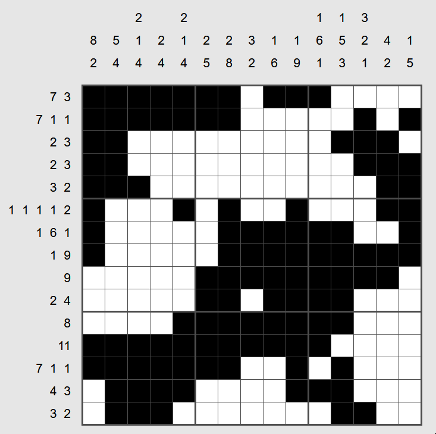

# Nonograms (Puzzle Type #1)

This is a dedicated solver for Nonograms (Called "Pattern" in the website)

Below are the details of how to utilize the solver. In addition, the solver gives all possible solutions to the input thus it can be utilized to figure out if a single output has multiple possible solutions.

(The solver mainly utilizes the CP-SAT solver from Google OR-Tools)

Game: https://www.chiark.greenend.org.uk/~sgtatham/puzzles/js/pattern.html

Instructions: https://www.chiark.greenend.org.uk/~sgtatham/puzzles/doc/pattern.html#pattern

Unsolved puzzle:


Code to utilize this package and solve the puzzle:
```python
import board
top_numbers = [
  [8, 2],
  ...
  [1, 5],
]  # top clues, ommited here for brevity
side_numbers = [
  [7, 3],
  ...
  [3, 2],
]  # side clues, ommited here for brevity
binst = board.Board(top=top_numbers, side=side_numbers)
solutions = binst.solve_and_print()
```
Output:
```
Solution found
B B B B B B B . B B B . . . .
B B B B B B B . . . . . B . B
B B . . . . . . . . . B B B .
B B . . . . . . . . . . B B B
B B B . . . . . . . . . . B B
B . . . B . B . . B . . . B B
B . . . . . B B B B B B . . B
B . . . . . B B B B B B B B B
. . . . . B B B B B B B B B .
. . . . . B B . B B B B . . .
. . . . B B B B B B B B . . .
B B B B B B B B B B B . . . .
B B B B B B B . . B . B . . .
. B B B B . . . . B B B . . .
. B B B . . . . . . . B B . .
Solutions found: 1
status: OPTIMAL
```

True solutions:


