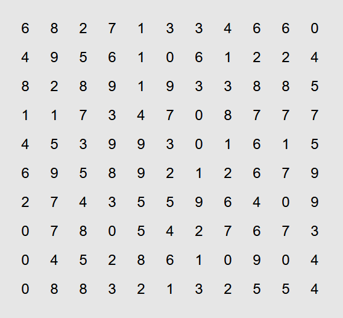
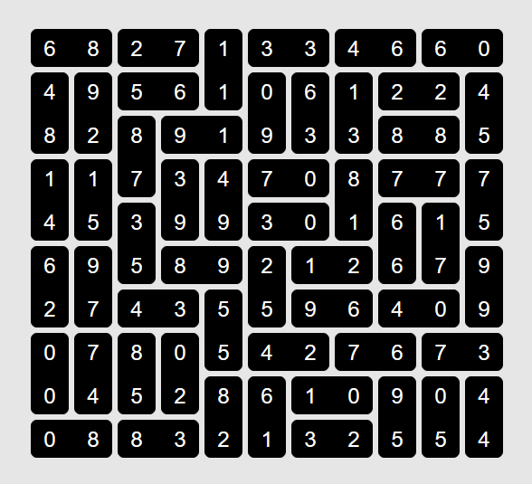

# Dominosa (Puzzle Type #4)

This is a dedicated solver for Dominosa

Below are the details of how to utilize the solver. In addition, the solver gives all possible solutions to the input thus it can be utilized to figure out if a single partial input board has multiple possible solutions.

(The solver under the hood mainly utilizes the CP-SAT solver from Google OR-Tools)

* [**Play online**](https://www.chiark.greenend.org.uk/~sgtatham/puzzles/js/dominosa.html)

* [**Instructions**](https://www.chiark.greenend.org.uk/~sgtatham/puzzles/doc/dominosa.html#dominosa)

A normal set of dominoes – that is, one instance of every (unordered) pair of numbers from 0 to N – has been arranged irregularly into a rectangle; then the number in each square has been written down and the dominoes themselves removed. 

Your task is to reconstruct the pattern by arranging the set of dominoes to match the provided array of numbers. 

**Unsolved puzzle**



Code to utilize this package and solve the puzzle:
```python
import numpy as np
from . import solver
bor = np.array([
  [6, 8, 2, 7, 1, 3, 3, 4, 6, 6, 0],
  [4, 9, 5, 6, 1, 0, 6, 1, 2, 2, 4],
  [8, 2, 8, 9, 1, 9, 3, 3, 8, 8, 5],
  [1, 1, 7, 3, 4, 7, 0, 8, 7, 7, 7],
  [4, 5, 3, 9, 9, 3, 0, 1, 6, 1, 5],
  [6, 9, 5, 8, 9, 2, 1, 2, 6, 7, 9],
  [2, 7, 4, 3, 5, 5, 9, 6, 4, 0, 9],
  [0, 7, 8, 0, 5, 4, 2, 7, 6, 7, 3],
  [0, 4, 5, 2, 8, 6, 1, 0, 9, 0, 4],
  [0, 8, 8, 3, 2, 1, 3, 2, 5, 5, 4],
])
binst = solver.Board(board=bor)
solutions = binst.solve_and_print()
assert len(solutions) == 1, f'unique solutions != 1, == {len(solutions)}'
```
**Script Output**
```
Solution found
[['R' 'L' 'R' 'L' 'D' 'R' 'L' 'R' 'L' 'R' 'L']
 ['D' 'D' 'R' 'L' 'U' 'D' 'D' 'D' 'R' 'L' 'D']
 ['U' 'U' 'D' 'R' 'L' 'U' 'U' 'U' 'R' 'L' 'U']
 ['D' 'D' 'U' 'D' 'D' 'R' 'L' 'D' 'R' 'L' 'D']
 ['U' 'U' 'D' 'U' 'U' 'R' 'L' 'U' 'D' 'D' 'U']
 ['D' 'D' 'U' 'R' 'L' 'D' 'R' 'L' 'U' 'U' 'D']
 ['U' 'U' 'R' 'L' 'D' 'U' 'R' 'L' 'R' 'L' 'U']
 ['D' 'D' 'D' 'D' 'U' 'R' 'L' 'R' 'L' 'R' 'L']
 ['U' 'U' 'U' 'U' 'D' 'D' 'R' 'L' 'D' 'D' 'D']
 ['R' 'L' 'R' 'L' 'U' 'U' 'R' 'L' 'U' 'U' 'U']]
Solutions found: 1
status: OPTIMAL
Time taken: 0.02 seconds
```

**Solved puzzle**


