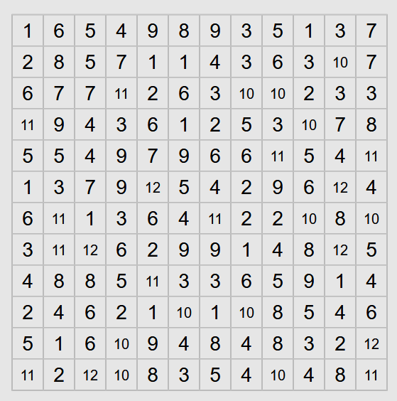
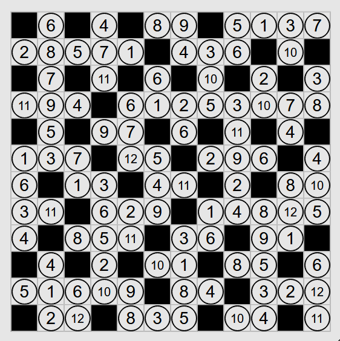

# Singles (Puzzle Type #8)

This is a dedicated solver for Singles

Below are the details of how to utilize the solver. In addition, the solver gives all possible solutions to the input thus it can be utilized to figure out if a single output has multiple possible solutions.

(The solver mainly utilizes the CP-SAT solver from Google OR-Tools)

* [**Play online**](https://www.chiark.greenend.org.uk/~sgtatham/puzzles/js/single.html)

* [**Instructions**](https://www.chiark.greenend.org.uk/~sgtatham/puzzles/doc/single.html#single)

**Unsolved puzzle**



Code to utilize this package and solve the puzzle:
```python
import numpy as np
from . import board
bor = np.array([
  [1, 6, 5, 4, 9, 8, 9, 3, 5, 1, 3, 7],
  [2, 8, 5, 7, 1, 1, 4, 3, 6, 3, 10, 7],
  [6, 7, 7, 11, 2, 6, 3, 10, 10, 2, 3, 3],
  [11, 9, 4, 3, 6, 1, 2, 5, 3, 10, 7, 8], 
  [5, 5, 4, 9, 7, 9, 6, 6, 11, 5, 4, 11],
  [1, 3, 7, 9, 12, 5, 4, 2, 9, 6, 12, 4],
  [6, 11, 1, 3, 6, 4, 11, 2, 2, 10, 8, 10],
  [3, 11, 12, 6, 2, 9, 9, 1, 4, 8, 12, 5],
  [4, 8, 8, 5, 11, 3, 3, 6, 5, 9, 1, 4],
  [2, 4, 6, 2, 1, 10, 1, 10, 8, 5, 4, 6],
  [5, 1, 6, 10, 9, 4, 8, 4, 8, 3, 2, 12],
  [11, 2, 12, 10, 8, 3, 5, 4, 10, 4, 8, 11],
])
binst = board.Board(board=bor)
solutions = binst.solve_and_print()
```
**Script Output**
```
Solution found
[['B' ' ' 'B' ' ' 'B' ' ' ' ' 'B' ' ' ' ' ' ' ' ']
 [' ' ' ' ' ' ' ' ' ' 'B' ' ' ' ' ' ' 'B' ' ' 'B']
 ['B' ' ' 'B' ' ' 'B' ' ' 'B' ' ' 'B' ' ' 'B' ' ']
 [' ' ' ' ' ' 'B' ' ' ' ' ' ' ' ' ' ' ' ' ' ' ' ']
 ['B' ' ' 'B' ' ' ' ' 'B' ' ' 'B' ' ' 'B' ' ' 'B']
 [' ' ' ' ' ' 'B' ' ' ' ' 'B' ' ' ' ' ' ' 'B' ' ']
 [' ' 'B' ' ' ' ' 'B' ' ' ' ' 'B' ' ' 'B' ' ' ' ']
 [' ' ' ' 'B' ' ' ' ' ' ' 'B' ' ' ' ' ' ' ' ' ' ']
 [' ' 'B' ' ' ' ' ' ' 'B' ' ' ' ' 'B' ' ' ' ' 'B']
 ['B' ' ' 'B' ' ' 'B' ' ' ' ' 'B' ' ' ' ' 'B' ' ']
 [' ' ' ' ' ' ' ' ' ' 'B' ' ' ' ' 'B' ' ' ' ' ' ']
 ['B' ' ' ' ' 'B' ' ' ' ' ' ' 'B' ' ' ' ' 'B' ' ']]
Solutions found: 1
status: OPTIMAL
Time taken: 2.14 seconds
```

**Solved puzzle**


