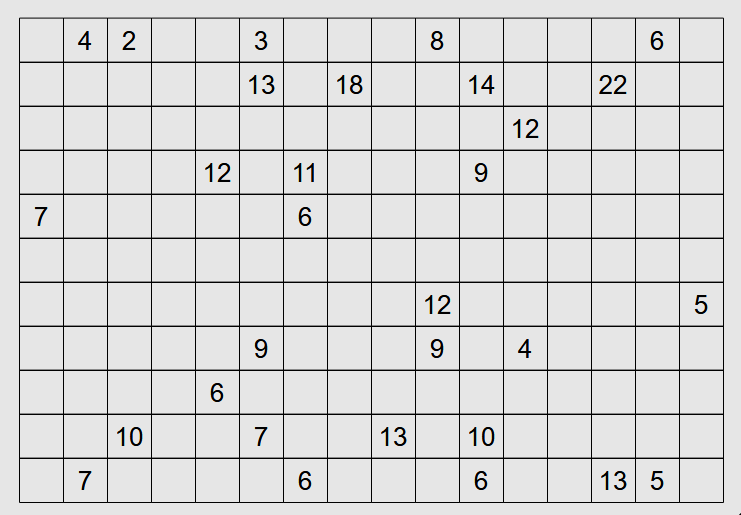
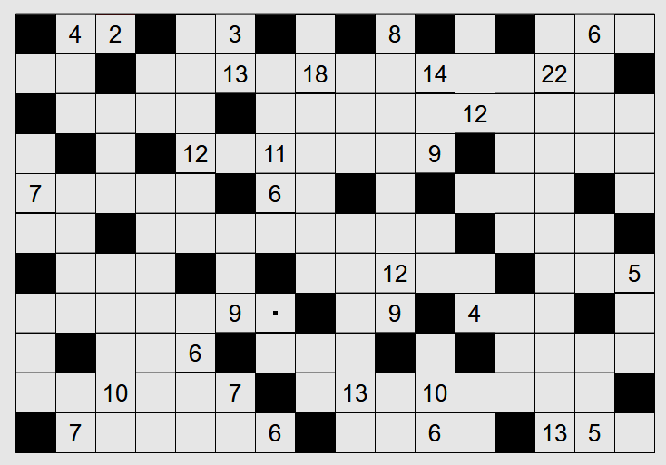

# Range (Puzzle Type #11)

This is a dedicated solver for Range

Below are the details of how to utilize the solver. In addition, the solver gives all possible solutions to the input thus it can be utilized to figure out if a single partial input board has multiple possible solutions.

(The solver mainly utilizes the CP-SAT solver from Google OR-Tools)

* [**Play online**](https://www.chiark.greenend.org.uk/~sgtatham/puzzles/js/range.html)

* [**Instructions**](https://www.chiark.greenend.org.uk/~sgtatham/puzzles/doc/range.html#range)

You have a grid of squares; some squares contain numbers. Your job is to colour some of the squares black, such that several criteria are satisfied:

  - no square with a number is coloured black.
  - no two black squares are adjacent (horizontally or vertically).
  - for any two white squares, there is a path between them using only white squares.
  - for each square with a number, that number denotes the total number of white squares reachable from that square going in a straight line in any horizontal or vertical direction until hitting a wall or a black square; the square with the number is included in the total (once).

For instance, a square containing the number one must have four black squares as its neighbours by the last criterion; but then it's impossible for it to be connected to any outside white square, which violates the second to last criterion. So no square will contain the number one. 

(Note: The solver for this puzzle is slightly slower and could take several seconds to solve a 16x11 puzzle)

**Unsolved puzzle**



Code to utilize this package and solve the puzzle:
```python
import numpy as np
from . import solver
clues = np.array([
    [-1, 4, 2, -1, -1, 3, -1, -1, -1, 8, -1, -1, -1, -1, 6, -1],
    [-1, -1, -1, -1, -1, 13, -1, 18, -1, -1, 14, -1, -1, 22, -1, -1],
    [-1, -1, -1, -1, -1, -1, -1, -1, -1, -1, -1, 12, -1, -1, -1, -1],
    [-1, -1, -1, -1, 12, -1, 11, -1, -1, -1, 9, -1, -1, -1, -1, -1],
    [7, -1, -1, -1, -1, -1, 6, -1, -1, -1, -1, -1, -1, -1, -1, -1],
    [-1, -1, -1, -1, -1, -1, -1, -1, -1, -1, -1, -1, -1, -1, -1, -1],
    [-1, -1, -1, -1, -1, -1, -1, -1, -1, 12, -1, -1, -1, -1, -1, 5],
    [-1, -1, -1, -1, -1, 9, -1, -1, -1, 9, -1, 4, -1, -1, -1, -1],
    [-1, -1, -1, -1, 6, -1, -1, -1, -1, -1, -1, -1, -1, -1, -1, -1],
    [-1, -1, 10, -1, -1, 7, -1, -1, 13, -1, 10, -1, -1, -1, -1, -1],
    [-1, 7, -1, -1, -1, -1, 6, -1, -1, -1, 6, -1, -1, 13, 5, -1],
])
binst = solver.Board(clues)
solutions = binst.solve_and_print()
```
**Script Output**
```
Solution:
B . . B . . B . B . B . B . . .
. . B . . . . . . . . . . . . B
B . . . . B . . . . . . . . . .
. B . B . . . . . . . B . . . .
. . . . . B . . B . B . . . B .
. . B . . . . . . . . B . . . B
B . . . B . B . . . . . B . . .
. . . . . . . B . . B . . . B .
. B . . . B . . . B . B . . . .
. . . . . . B . . . . . . . . B
B . . . . . . B . . . . B . . .
Solutions found: 1
status: OPTIMAL
Time taken: 3.32 seconds
```

**Solved puzzle**


