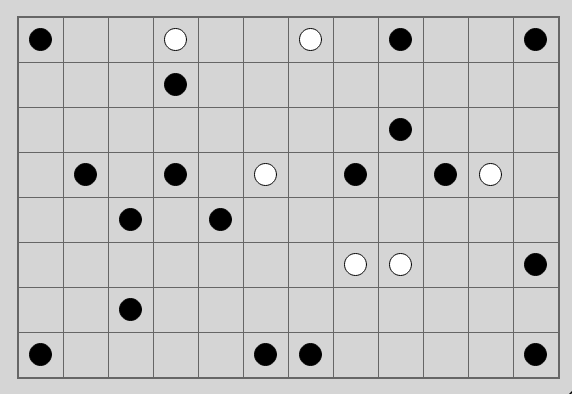
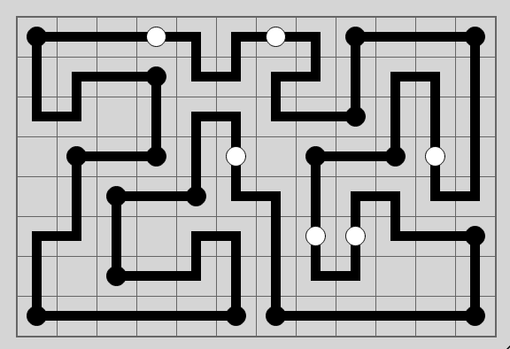

# Pearl (Puzzle Type #19)

This is a dedicated solver for Pearl

Below are the details of how to utilize the solver. In addition, the solver gives all possible solutions to the input thus it can be utilized to figure out if a single partial input board has multiple possible solutions.

(The solver under the hood mainly utilizes the CP-SAT solver from Google OR-Tools)

* [**Play online**](https://www.chiark.greenend.org.uk/~sgtatham/puzzles/js/pearl.html)

* [**Instructions**](https://www.chiark.greenend.org.uk/~sgtatham/puzzles/doc/pearl.html#pearl)

You have a grid of squares. Your job is to draw lines between the centres of horizontally or vertically adjacent squares, so that the lines form a single closed loop. In the resulting grid, some of the squares that the loop passes through will contain corners, and some will be straight horizontal or vertical lines. (And some squares can be completely empty – the loop doesn't have to pass through every square.)

Some of the squares contain black and white circles, which are clues that the loop must satisfy.

A black circle in a square indicates that that square is a corner, but neither of the squares adjacent to it in the loop is also a corner.

A white circle indicates that the square is a straight edge, but at least one of the squares adjacent to it in the loop is a corner.

(In both cases, the clue only constrains the two squares adjacent in the loop, that is, the squares that the loop passes into after leaving the clue square. The squares that are only adjacent in the grid are not constrained.)

**Unsolved puzzle**



Code to utilize this package and solve the puzzle:
```python
import numpy as np
from . import solver
bor = np.array([
  ['B', ' ', ' ', 'W', ' ', ' ', 'W', ' ', 'B', ' ', ' ', 'B'],
  [' ', ' ', ' ', 'B', ' ', ' ', ' ', ' ', ' ', ' ', ' ', ' '],
  [' ', ' ', ' ', ' ', ' ', ' ', ' ', ' ', 'B', ' ', ' ', ' '],
  [' ', 'B', ' ', 'B', ' ', 'W', ' ', 'B', ' ', 'B', 'W', ' '],
  [' ', ' ', 'B', ' ', 'B', ' ', ' ', ' ', ' ', ' ', ' ', ' '],
  [' ', ' ', ' ', ' ', ' ', ' ', ' ', 'W', 'W', ' ', ' ', 'B'],
  [' ', ' ', 'B', ' ', ' ', ' ', ' ', ' ', ' ', ' ', ' ', ' '],
  ['B', ' ', ' ', ' ', ' ', 'B', 'B', ' ', ' ', ' ', ' ', 'B'],
])
binst = solver.Board(bor)
solutions = binst.solve_and_print()
```
**Script Output**
```
Solution found
[['┏━' '━━' '━━' '━━' '━┒' '┏━' '━━' '━┒' '┏━' '━━' '━━' '━┒']
 ['┃ ' '┏━' '━━' '━┒' '┗━' '━┛' '┏━' '━┛' '┃ ' '┏━' '━┒' '┃ ']
 ['┗━' '━┛' '  ' '┃ ' '┏━' '━┒' '┗━' '━━' '━┛' '┃ ' '┃ ' '┃ ']
 ['  ' '┏━' '━━' '━┛' '┃ ' '┃ ' '  ' '┏━' '━━' '━┛' '┃ ' '┃ ']
 ['  ' '┃ ' '┏━' '━━' '━┛' '┗━' '━┒' '┃ ' '┏━' '━┒' '┗━' '━┛']
 ['┏━' '━┛' '┃ ' '  ' '┏━' '━┒' '┃ ' '┃ ' '┃ ' '┗━' '━━' '━┒']
 ['┃ ' '  ' '┗━' '━━' '━┛' '┃ ' '┃ ' '┗━' '━┛' '  ' '  ' '┃ ']
 ['┗━' '━━' '━━' '━━' '━━' '━┛' '┗━' '━━' '━━' '━━' '━━' '━┛']]
Solutions found: 1
status: OPTIMAL
Time taken: 1.12 seconds
```

**Solved puzzle**


