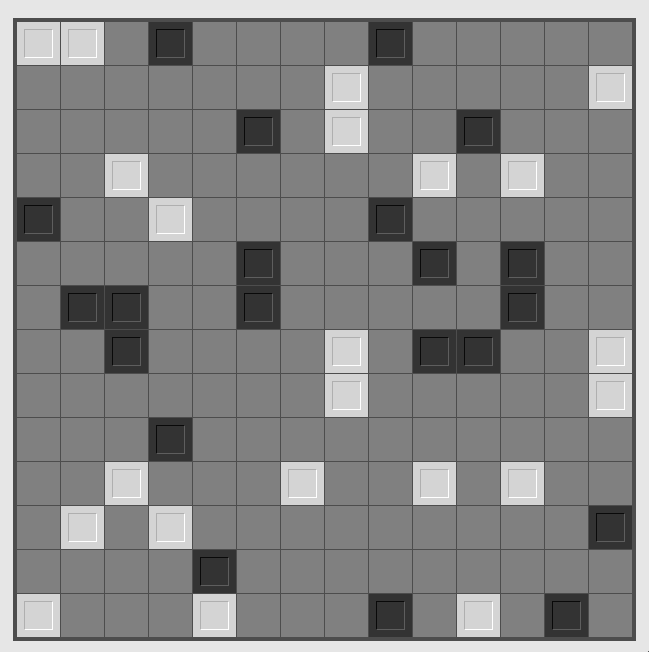

# Unruly (Puzzle Type #9)

This is a dedicated solver for Unruly

Below are the details of how to utilize the solver. In addition, the solver gives all possible solutions to the input thus it can be utilized to figure out if a single output has multiple possible solutions.

(The solver mainly utilizes the CP-SAT solver from Google OR-Tools)

Game: https://www.chiark.greenend.org.uk/~sgtatham/puzzles/js/unruly.html

Instructions: https://www.chiark.greenend.org.uk/~sgtatham/puzzles/doc/unruly.html#unruly

Unsolved puzzle:



Code to utilize this package and solve the puzzle:
```python
import numpy as np
import board
bor = np.array([
  ['W', 'W', '*', 'B', '*', '*', '*', '*', 'B', '*', '*', '*', '*', '*'],
  ['*', '*', '*', '*', '*', '*', '*', 'W', '*', '*', '*', '*', '*', 'W'],
  ['*', '*', '*', '*', '*', 'B', '*', 'W', '*', '*', 'B', '*', '*', '*'],
  ['*', '*', 'W', '*', '*', '*', '*', '*', '*', 'W', '*', 'W', '*', '*'],
  ['B', '*', '*', 'W', '*', '*', '*', '*', 'B', '*', '*', '*', '*', '*'],
  ['*', '*', '*', '*', '*', 'B', '*', '*', '*', 'B', '*', 'B', '*', '*'],
  ['*', 'B', 'B', '*', '*', 'B', '*', '*', '*', '*', '*', 'B', '*', '*'],
  ['*', '*', 'B', '*', '*', '*', '*', 'W', '*', 'B', 'B', '*', '*', 'W'],
  ['*', '*', '*', '*', '*', '*', '*', 'W', '*', '*', '*', '*', '*', 'W'],
  ['*', '*', '*', 'B', '*', '*', '*', '*', '*', '*', '*', '*', '*', '*'],
  ['*', '*', 'W', '*', '*', '*', 'W', '*', '*', 'W', '*', 'W', '*', '*'],
  ['*', 'W', '*', 'W', '*', '*', '*', '*', '*', '*', '*', '*', '*', 'B'],
  ['*', '*', '*', '*', 'B', '*', '*', '*', '*', '*', '*', '*', '*', '*'],
  ['W', '*', '*', '*', 'W', '*', '*', '*', 'B', '*', 'W', '*', 'B', '*'],
])
binst = board.Board(board=bor)
solutions = binst.solve_and_print()
```
Output:
```
Solution found
[['W' 'W' 'B' 'B' 'W' 'B' 'W' 'B' 'B' 'W' 'B' 'W' 'W' 'B']
 ['B' 'B' 'W' 'W' 'B' 'W' 'B' 'W' 'W' 'B' 'W' 'B' 'B' 'W']
 ['W' 'W' 'B' 'W' 'W' 'B' 'B' 'W' 'B' 'W' 'B' 'B' 'W' 'B']
 ['W' 'B' 'W' 'B' 'B' 'W' 'W' 'B' 'W' 'W' 'B' 'W' 'B' 'B']
 ['B' 'W' 'B' 'W' 'B' 'W' 'B' 'W' 'B' 'B' 'W' 'W' 'B' 'W']
 ['B' 'W' 'W' 'B' 'W' 'B' 'B' 'W' 'B' 'B' 'W' 'B' 'W' 'W']
 ['W' 'B' 'B' 'W' 'W' 'B' 'W' 'B' 'W' 'W' 'B' 'B' 'W' 'B']
 ['B' 'W' 'B' 'W' 'B' 'W' 'B' 'W' 'W' 'B' 'B' 'W' 'B' 'W']
 ['B' 'B' 'W' 'B' 'B' 'W' 'B' 'W' 'B' 'W' 'W' 'B' 'W' 'W']
 ['W' 'W' 'B' 'B' 'W' 'B' 'W' 'B' 'W' 'B' 'W' 'W' 'B' 'B']
 ['B' 'B' 'W' 'W' 'B' 'W' 'W' 'B' 'B' 'W' 'B' 'W' 'B' 'W']
 ['B' 'W' 'B' 'W' 'W' 'B' 'B' 'W' 'W' 'B' 'W' 'B' 'W' 'B']
 ['W' 'B' 'W' 'B' 'B' 'W' 'W' 'B' 'W' 'B' 'B' 'W' 'W' 'B']
 ['W' 'B' 'W' 'B' 'W' 'B' 'W' 'B' 'B' 'W' 'W' 'B' 'B' 'W']]
Solutions found: 1
status: OPTIMAL
```

Which exactly matches the true solutions:


